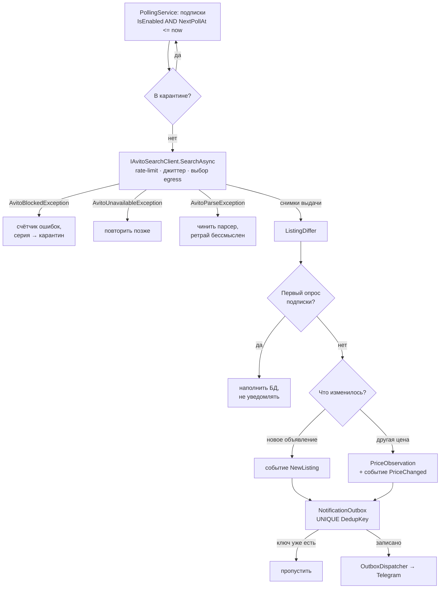

# AvitoRadar

Telegram-бот и Mini App, которые следят за объявлениями Avito по сохранённым поискам:
присылают новые объявления и изменения цен, считают ценовую статистику по нише.

Исходный код закрыт. Здесь — устройство системы и решения, которые за ним стоят.
Код покажу на собеседовании, доступ на чтение дам по запросу.

.NET 10 · ASP.NET Core Minimal API · EF Core, SQLite (WAL) · React, Vite, TypeScript ·
Telegram Bot API · Docker, Caddy · GitHub Actions

## Что умеет

- **Подписка** — сохранённый поиск: запрос, регион, раздел, цена от/до, состояние, только с фото.
  Можно вставить ссылку из Avito — сервер разберёт её в критерии.
- **Уведомления** о новом объявлении и об изменении цены — ровно одно сообщение на событие.
- **Аналитика** по подписке: медиана, p25/p75, гистограмма цен, динамика по дням,
  медианное время жизни объявления.
- **Админка**: одобрение пользователей, роли, здоровье поллера и прокси, журнал действий,
  рассылка, настройки опроса без передеплоя.

## Архитектура

Пользователей 2–3, и это несущее решение: оно вычёркивает очереди, микросервисы,
отдельный воркер-процесс и Postgres. Всё живёт в одном процессе ASP.NET Core,
фоновая работа — три `BackgroundService` внутри него. Фронт собирается Vite и отдаётся
тем же процессом как статика.

```
AvitoRadar.Server (один процесс)
├── HTTP API ─────────────┐
├── PollingService        │
│     └─ IAvitoSearchClient → ListingDiffer → NotificationOutbox
├── OutboxDispatcher ─────┼──▶ Telegram Bot API
└── TelegramBotService    │
                          ▼
                    SQLite (WAL)
```

Путь одного опроса — главный поток системы:



## Решения

### Шов на самой нестабильной зависимости

Avito меняет разметку, когда захочет, поэтому граница проведена здесь:

```csharp
Task<AvitoSearchPage> SearchAsync(AvitoSearchRequest request, CancellationToken ct);
```

За одним методом — сборка URL из критериев, выбор egress, rate-limiting, джиттер,
ретраи с backoff, распознавание страницы блокировки, разбор выдачи и пагинация.
Смена способа добычи данных (HTML → мобильное API → сторонний сервис) меняет только
эту реализацию: диффер, поллер и аналитика её не видят.

Ошибки — часть интерфейса и разделены по тому, что делать дальше:

| Исключение | Что случилось | Реакция |
|---|---|---|
| `AvitoBlockedException` | 429 / 403 / captcha | сменить egress, увеличить паузу, при серии — карантин |
| `AvitoUnavailableException` | сеть, таймаут, 5xx | повторить позже, расписание не трогать |
| `AvitoParseException` | ответ есть, выдачи нет | чинить парсер |

### Дедупликация — обязанность базы, а не кода

Диффер ничего не отправляет в Telegram — он пишет события в таблицу `NotificationOutbox`
с UNIQUE-индексом по ключу. Рестарт посреди опроса, повторный прогон, гонка двух циклов —
всё упирается в индекс, а не в аккуратность автора. Ключ собирается в одном месте:

```
{subscriptionId}:{itemId}:NewListing:
{subscriptionId}:{itemId}:PriceChanged:{price}
```

Цена входит в ключ изменения: скачок туда и обратно — два события, повторный прогон
того же изменения — одно.

### Правила диффера

- **Холодный старт молчит.** Первый опрос новой подписки наполняет базу и не порождает
  уведомлений — иначе человек получит 50 сообщений разом.
- **Цена пишется только при изменении.** Не на каждый опрос: иначе таблица растёт линейно
  по времени, а аналитика считает одно и то же сотни раз.
- **Объявление глобально одно.** Вещь из трёх подписок — одна строка и три связи.

### Расписание и карантин

В режиме `Auto` интервал опроса ходит в коридоре Min..Max: нашлось новое — интервал
сокращается, тишина — растёт. После серии ошибок подписка уходит в карантин
и перестаёт опрашиваться, пока человек не возобновит её: один сломанный поиск
не должен сжигать лимит запросов для остальных.

### Индексы под конкретные запросы

| Индекс | Кто по нему ходит |
|---|---|
| `Subscriptions (IsEnabled, NextPollAt)` | поллер: кого опрашивать следующим |
| `Listings.AvitoItemId` UNIQUE | диффер: видели ли это раньше |
| `SubscriptionListings (SubscriptionId, FirstSeenAt)` | лента с курсорной пагинацией |
| `PriceObservations (ListingId, ObservedAt)` | история цены и аналитика |
| `Outbox (SentAt, CreatedAt)` | диспетчер: что отправлять |

### Авторизация без паролей

Mini App присылает `initData`, сервер проверяет HMAC-SHA256 и свежесть `auth_date`.
Незнакомый пользователь заводится в статусе `Pending` и ждёт одобрения админа.
Вход без Telegram для разработки регистрируется в DI только в окружении Development —
в продовом контейнере этой реализации просто нет.

## Проверка

- 148 тестов xUnit. Тесты не ходят в сеть: парсинг проверяется на сохранённых страницах,
  включая настоящую страницу блокировки.
- GitHub Actions: сборка и тесты, публикация Docker-образа.
- Документация в репозитории: контекст и язык предметной области, архитектура,
  замороженный контракт HTTP API, админка, деплой.

## Статус

Приложение собрано целиком, кроме канала до Avito: с адреса разработки Avito отвечает
`429` с captcha, а через датацентровые прокси соединение не устанавливается. Когда
рабочий канал появится, это новая реализация `IAvitoSearchClient` и строка конфигурации,
а не переписывание приложения.
